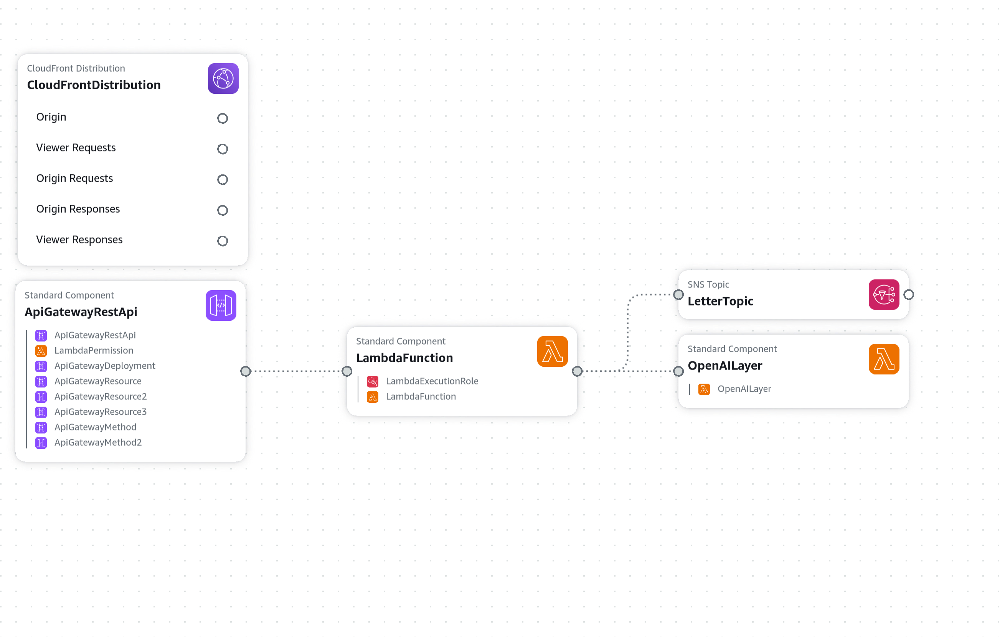

# **SambaSanta**

[](https://github.com/kevinl95/SambaSanta/actions/workflows/main.yml)

Bring the magic of Christmas to life! With **SambaSanta**, you can use AI to have Santa respond to children’s letters using **SambaNova Cloud** and **Amazon Web Services (AWS)**. Set up your app in minutes to send delightful letters directly from Santa's desk. SambaNova's fast inference times means you'll have an email letter from Santa in seconds from your own AWS-deployed letter writing app.

---

## **How to Deploy**

### **Step 1: Launch the Stack**
Click the button below to deploy the **SambaSanta** stack using AWS CloudFormation:

[](https://console.aws.amazon.com/cloudformation/home#/stacks/create/review?templateURL=https://sambasanta.s3.us-east-1.amazonaws.com/cloudformation.yml&stackName=SambaSanta)

This will open the AWS CloudFormation console with the **SambaSanta** template pre-loaded.
---

### **Step 2: Provide Stack Parameters**


You’ll be asked to provide the following parameters:

1. **MyEmail**:
   - Enter the email address where you want Santa's letters to be sent.
   - Example: `myemail@example.com`

2. **SambaNovaCloudKey**:
   - Enter your SambaNova Cloud API key.
   - If you don’t have an API key, sign up for SambaNova Cloud [here](https://www.sambanova.ai/).

⚠️ Your API key is sensitive and will be securely stored during stack deployment. It won’t appear in the stack outputs or logs.

Make sure check the box allowing AWS to deploy IAM roles- they are needed to send you your emails programatically!


---

### **Step 3: Review and Deploy**
1. Review the stack details and ensure your email and API key are correct.
2. Click **Create Stack** to start the deployment process.

CloudFormation will provision all necessary AWS resources, including:
- An **SNS Topic** for email notifications.
- A **Lambda function** to generate Santa's letters using the SambaNova API. This Lambda function includes an OpenAI layer that will be used to authenticate with SambaNova. If you'd like to build your own layer or check how we made ours, check out the layer.sh script in this repository! You can then replace the path to our zip archive with your own in CloudFormation.yml if you wish.
- An **API Gateway** and **CloudFront distribution** to host the web app.


**Be sure to visit your email during deployment and hit "Confirm subscription" in the SNS email you will receive to authorize the application to send you emails! You will not receive any responses from SabmaSanta until you do so!**


---

### **Step 4: Use Your App**
Once the deployment completes:
1. Find the **output page URL** in the **CloudFormation Outputs** section.

2. Visit the URL to start sending letters to Santa!

---

## **How It Works**
- Users write letters to Santa via the web app.
- The **Lambda function** processes the letter and uses Llama to write a response as Santa using the **SambaNova Cloud API**.
- Santa's response is emailed to the provided address via **SNS** (Amazon Simple Notification Service).


Below is a full diagram of the application:




---

## **Project Features**
- 🎄 **Interactive web interface**: Write letters to Santa on your device of choice.
- 🎅 **AI-generated responses**: Santa’s replies are powered by Llama running on SambaNova Cloud.
- 📧 **Email notifications**: Responses are sent directly to your inbox.

---

## Local Development

A simple pyproject.toml is provided for playing with the Lambda code locally, which you can find in main.py. You can install poetry:

```
python -m pip install poetry
```

And then get an environment with the same OpenAI version we use in our layer by running poetry install:

```
poetry install
```

This is also required to invoke layer.zip, which will bundle the latest OpenAI Python SDK into a zip file you can use as a Lambda layer instead of ours, if you choose.

---

## **License**
This project is licensed under the MIT License. See the [LICENSE](LICENSE) file for details.

---
